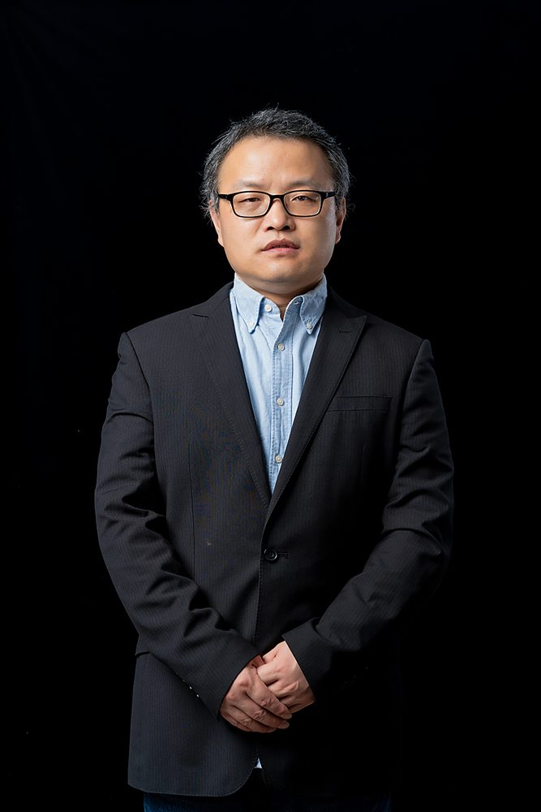

# 王海

- 栏目：网络空间安全与数字媒体系
- 日期：2026-04-30
- 原文：https://site.gcc.edu.cn/xydw/wlkjaqyszmt/wlkjaqjys/b8219e55e0ae457491a1f11ddc4b4d05.htm
- 照片：
  - 网络空间安全与数字媒体系\王海.jpg

王海，工程硕士，副教授，广东省民办教育优秀教师。研究方向：分布式系统、微服务架构及算法优化等。主持或参与省部级教研教改课题6项，发表教研教改论文十余篇，参编教材5本，2项国家实用新型专利，软件著作登记权2项。指导学生参加广东省大学生计算机设计大赛、“挑战杯-彩虹人生”广东职业院校创新创业大赛等各类竞赛，获奖十余项。
