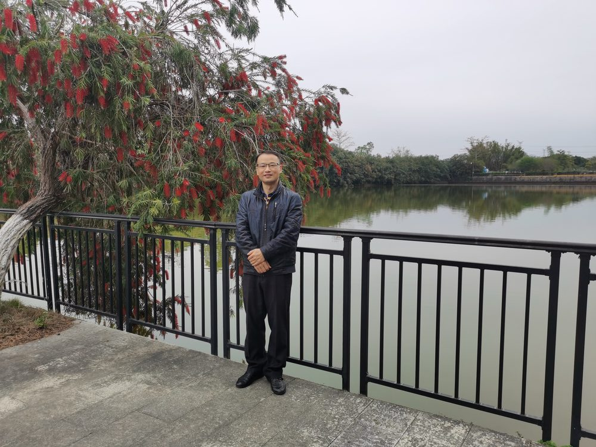

# 肖红

- 栏目：网络空间安全与数字媒体系
- 日期：2026-04-30
- 原文：https://site.gcc.edu.cn/xydw/wlkjaqyszmt/wlkjaqjys/99d45977503e41ae810a851f7ec085b3.htm
- 照片：
  - 网络空间安全与数字媒体系\肖红.jpg

肖红，男，硕士研究生，副教授。长期从事专业教学、科学研究与学生培养工作，教学经验丰富。

科研教研层面，聚焦专业领域研究，累计公开发表学术论文10篇；主持省级课题1项、校级课题3项；主编省级规划教材1部。深耕课堂教学改革，荣获省级教学能力竞赛三等奖1项，中教集团教学能力竞赛二等奖1项，校级教学能力竞赛一等奖、二等奖各1项；主持建设学银在线开放课程1门，积极推动信息化教学与线上线下混合式教学落地实施。

人才培养方面，专注学生实践能力与综合素质提升，常态化指导学生参与各类专业技能竞赛，指导学生荣获国家级一等奖1项、二等奖1项、三等奖3项，省级竞赛奖项十余项。

履职期间，师德师风端正，工作勤勉务实，先后4次获评学校优秀教师、1次获评民办优秀教师。
