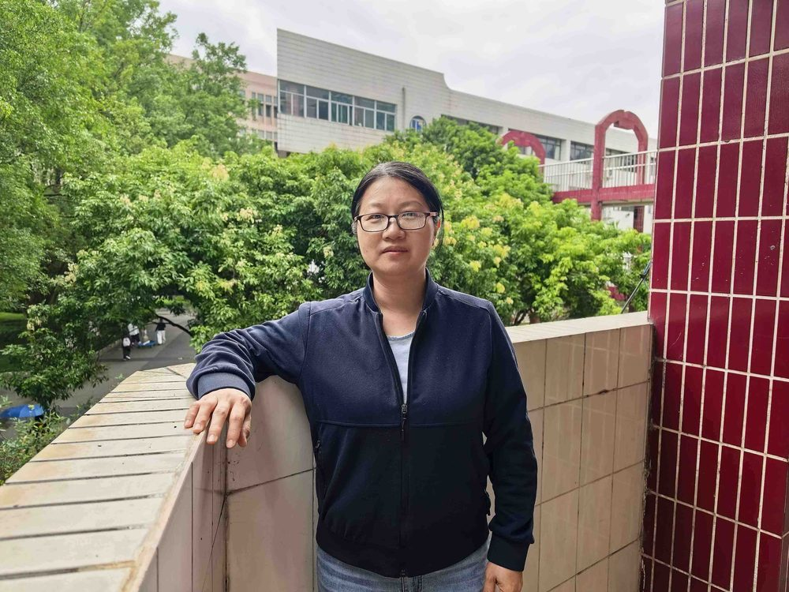

# 何惠甜

- 栏目：计算机基础教研室
- 日期：2026-05-06
- 原文：https://site.gcc.edu.cn/xydw/jsjjcjys1/e825597c1ad84f978dcbf8bb5a2b44c3.htm
- 照片：
  - 计算机基础教研室\何惠甜.jpg

何惠甜，工学硕士，讲师。2002年毕业于华南师范大学，2009年获得中山大学计算机软件与理论专业硕士学位。

现任信息技术与工程学院专任教师，主要担任“人工智能通识基础”、“计算机应用基础”、“办公软件高级应用”、“计算机图像处理技术基础”等课程的教学，丰富的教学与实践经验。

主持和参与省级校级课题多项，发表论文有《RFID防碰撞技术中的算法分析》等13论文。

20多年初心不变，全心致力于高校的教学实践工作中，一直为学校和学生的发展奋斗着。
