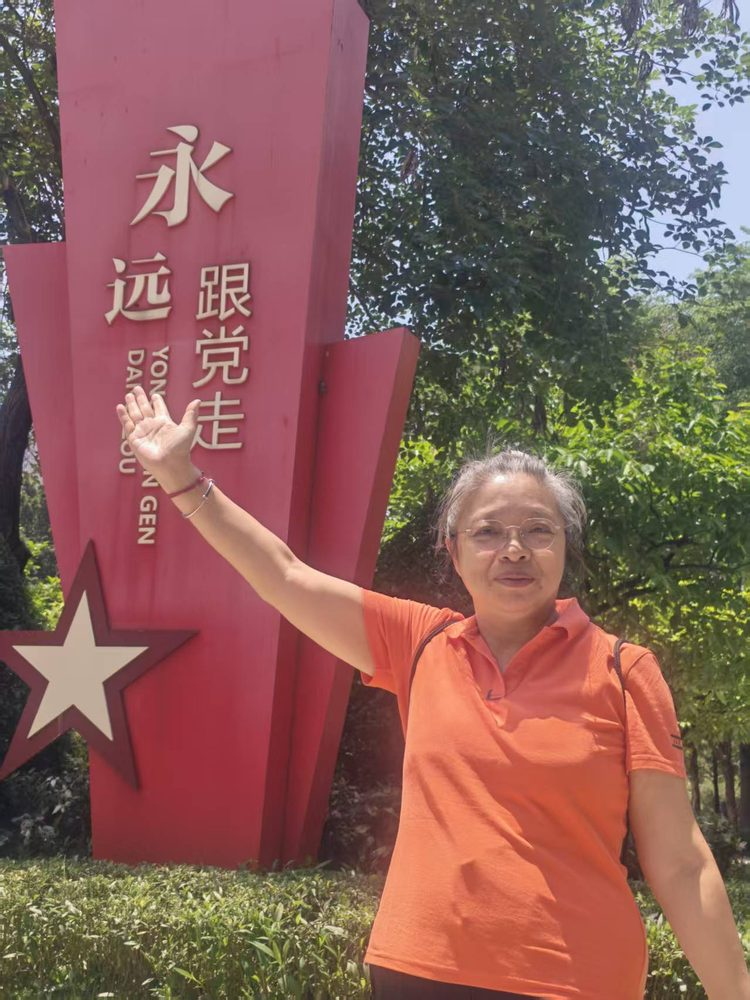

# 李蓉

- 栏目：计算机基础教研室
- 日期：2026-05-06
- 原文：https://site.gcc.edu.cn/xydw/jsjjcjys1/2b9fbe3393a34ca0bdcc6ace01492a9e.htm
- 照片：
  - 计算机基础教研室\李蓉.jpg

李蓉，1998年毕业于东北大学计算机及应用专业，1999年入职广州商学院，教授。主要研究方向为模式识别、图像识别与人工智能。主讲《计算机应用基础》、《办公软件高级应用》、《数据库技术与应用》及《人工智能通识课》等课程。任教以来累计发表论文30余篇，其中中文核心期刊论文10余篇，长期深耕教学科研一线，在计算机基础教育改革、智能算法应用等领域形成稳定研究方向，具备扎实的学术积累与教学实践能力。
