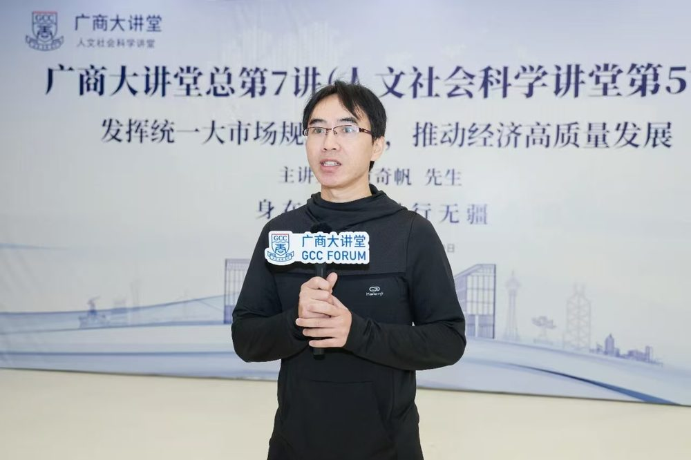

# 梁智斌

- 栏目：计算机基础教研室
- 日期：2026-05-08
- 原文：https://site.gcc.edu.cn/xydw/jsjjcjys1/b66a5d72849c486eae0797c6b55feca7.htm
- 照片：
  - 计算机基础教研室\梁智斌.jpg

梁智斌，信息技术与工程学院计算机基础教研室专任教师，硕士，讲师。研究领域为信息素养、数字资源建设。教学课程有动态网站设计、小程序应用开发、办公软件高级应用等。近年参与项目2024年广东省本科院校“新时代计算机课程体系与资源建设”专项课题、PHP网页设计课程教研室等教改课题3项。指导学生获广东省“挑战杯”大学生课外学术科技作品竞赛二等奖1项。多次指导学生参与广东省“百千万工程”突击队暨暑期“三下乡”社会实践活动行动获“优秀指导老师”。
