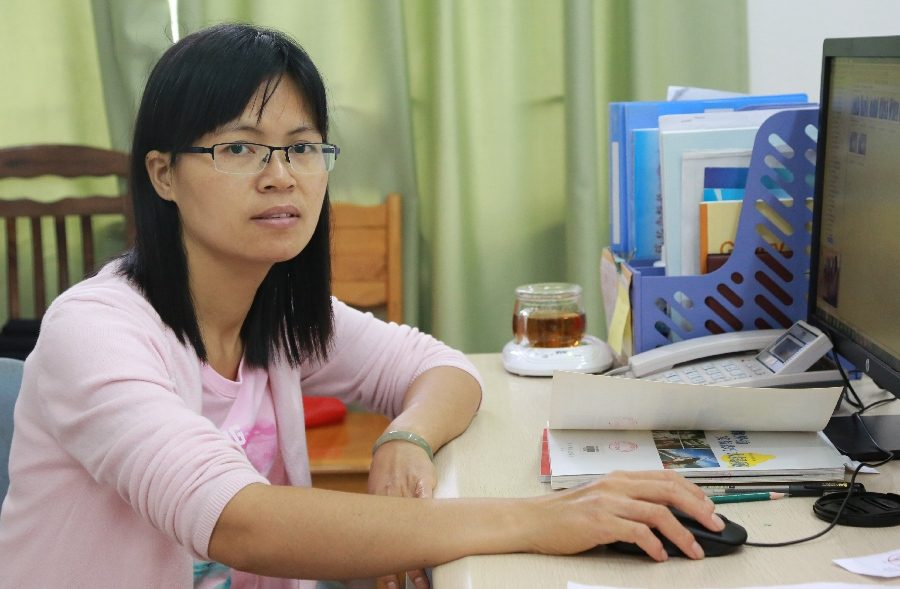

# 汤兰芳

- 栏目：计算机基础教研室
- 日期：2026-05-08
- 原文：https://site.gcc.edu.cn/xydw/jsjjcjys1/02f87d627a88474bb9c9d543ef9e51f9.htm
- 照片：
  - 计算机基础教研室\汤兰芳.jpg

汤兰芳，硕士，讲师。自2002年任教以来，为学生主讲过《计算机应用基础》、《图形图像处理技术》、《办公软件高级应用》、《人工智能通识教程》等课程，教学经验丰富，注重理论与实践结合，擅长通过案例教学、项目驱动等方式激发学生兴趣，提升学生计算机应用能力；教学效果优秀，多次获得校级绩效考核优秀奖。
