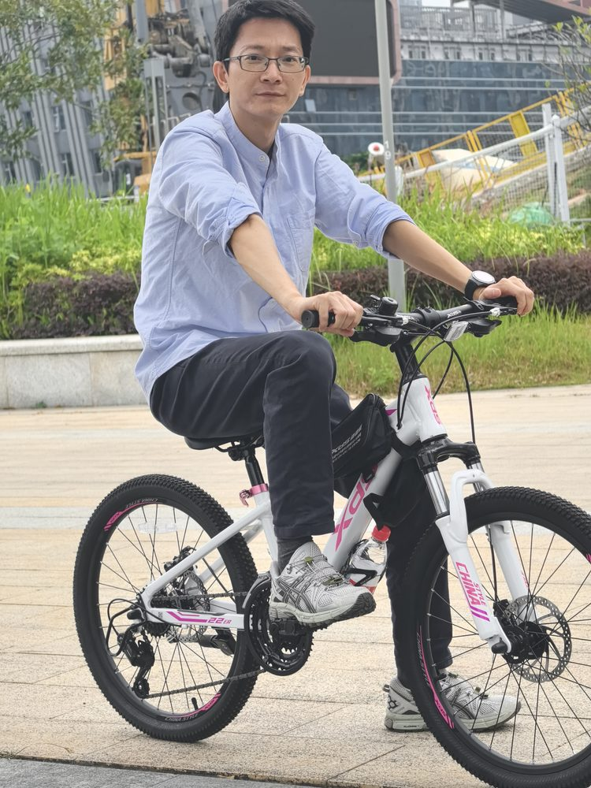

# 翁权杰

- 栏目：计算机基础教研室
- 日期：2026-05-08
- 原文：https://site.gcc.edu.cn/xydw/jsjjcjys1/ba8a7cb0a6f24e0287f6955da1d27340.htm
- 照片：
  - 计算机基础教研室\翁权杰.jpg

翁权杰，男，副教授，毕业于华南师范大学计算机应用技术专业。主讲课程包括有《Python语言程序设计》《高级程序设计》《人工智能通识基础》《数据分析与数据挖掘》《WEB应用开发》等，参与主编《Python程序设计》、《办公软件高级应用》等5部教材。近年来多次带领学生参加大学生计算机设计大赛，获得过国家级奖项1项，省级奖项10余项。

获奖情况：

1、2018年获得教师节“优秀教学奖”

2、2022年获得教师节“优秀教学奖”

3、2024年获得教师节“优秀教学奖”
