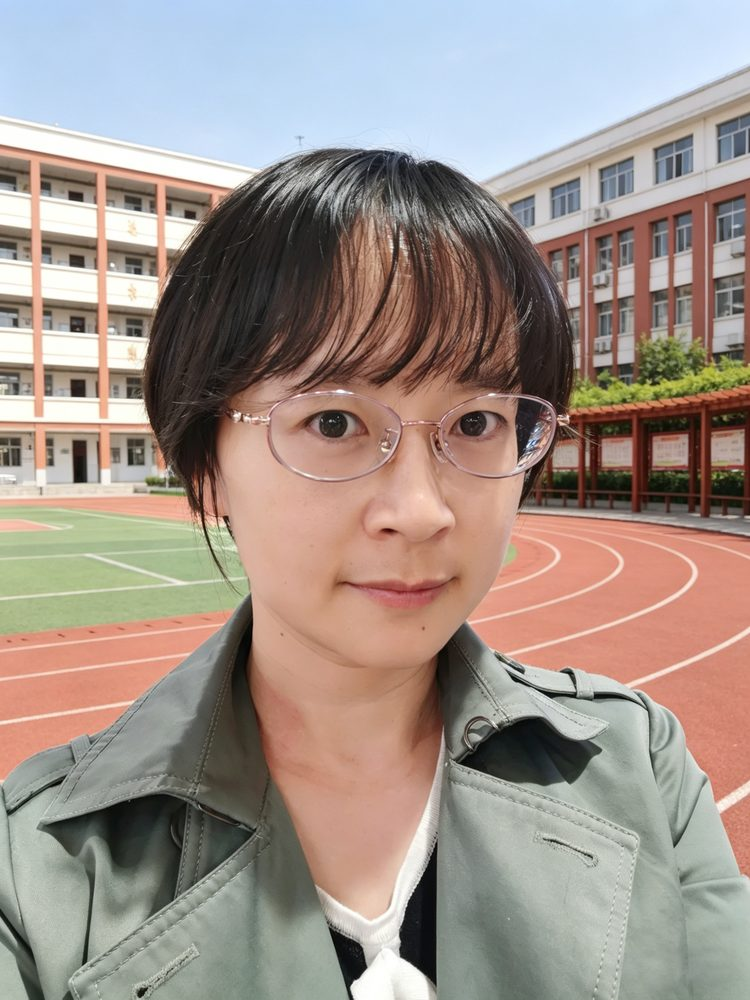

# 贺琳

- 栏目：计算机基础教研室
- 日期：2026-05-06
- 原文：https://site.gcc.edu.cn/xydw/jsjjcjys1/04e7e81ced63452183e5972c822337b8.htm
- 照片：
  - 计算机基础教研室\贺琳.jpg

贺琳，硕士研究生，2012年毕业于华南师范大学，“双师双能”型教师。主讲过《计算机应用基础》《办公软件高级应用》《程序设计基础》《面向对象程序设计》《数据库原理与应用》等多门课程。作为负责人，主持建设1门校级优秀课程，主要研究方向为教学设计、计算机应用。

教学理念：淡化形式，注重实质；深挖基础，慢工细活——力求学生学得懂、用得上。
