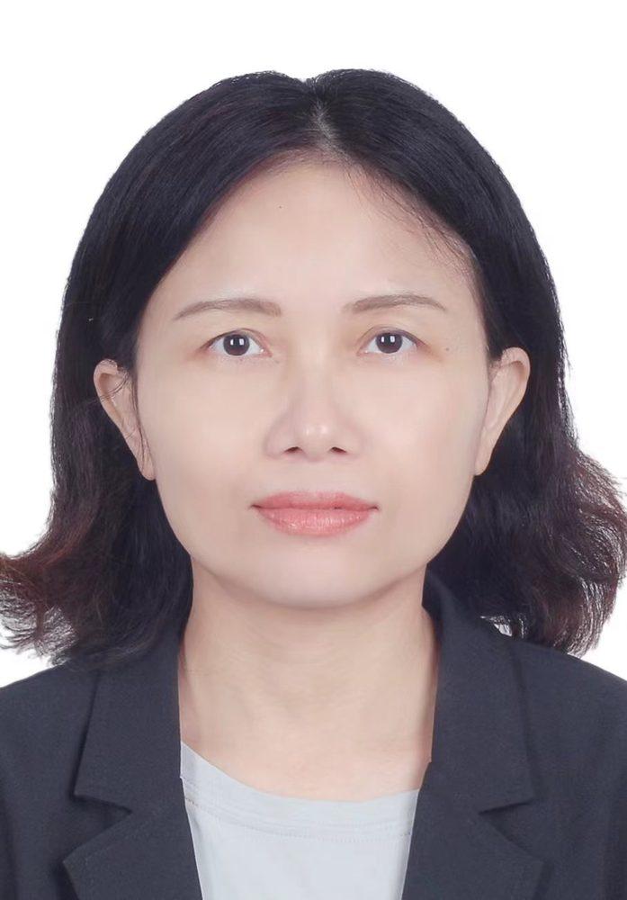

# 郑燕姣

- 栏目：计算机基础教研室
- 日期：2026-05-08
- 原文：https://site.gcc.edu.cn/xydw/jsjjcjys1/5bc50d80a28546509799af68cd7731c8.htm
- 照片：
  - 计算机基础教研室\郑燕姣.jpg

郑燕姣，硕士研究生，副教授，毕业以来长期深耕高校计算机教学与科研一线，始终坚守教育初心，恪守教师职责，注重思想政治修养与专业素养的持续提升。教学上，努力钻研计算机科学与实践教学，创新课堂教学模式，积极指导学生参加IT 技能竞赛等实践活动，耐心答疑解惑、精准指导，助力学生获得相关赛事奖项，同时着力提升学生实操能力，指导班级的学生计算机等级考试平均通过率优秀，编写的教学实践案例获教育部高校计算机类教指委优秀案例评选一等奖。科研上，发表论文 9 篇，参与编写计算机类教材 1 部，获软件著作 2 个，主持并参与的教改及科研课题8项，教学与科研能力突出，履职尽责、成效显著。
