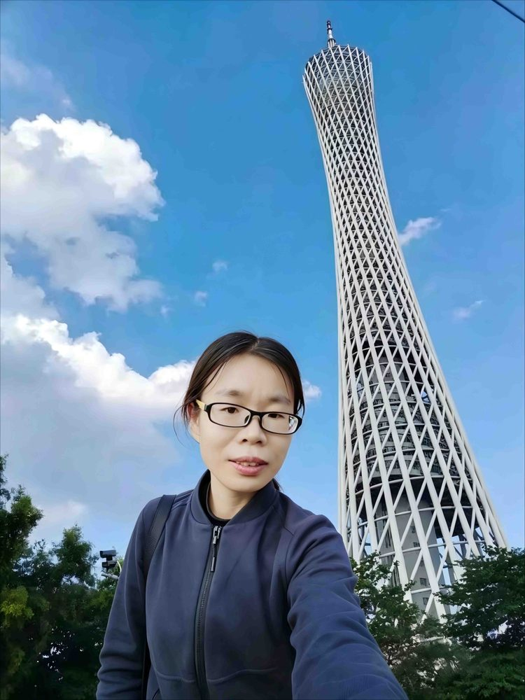

# 何吕君

- 栏目：计算机科学与工程系
- 日期：2026-04-27
- 原文：https://site.gcc.edu.cn/xydw/jsjkxygcx1/wljsygcjys1/c077bd69344645c5b6b3012a8746bb6d.htm
- 照片：
  - 计算机科学与工程系\何吕君.jpg

湘潭大学 工程硕士 控制工程 2011-2014

湘潭大学 工学学士 建筑设施与智能技术 2007-2011

研究领域：机器学习、数据挖掘与嵌入式系统

主讲课程：Linux操作系统与应用、鸿蒙南向设备开发、面向对象程序设计、概率论等

科研成果：参与编著教材《Linux操作系统与应用项目化教程》，发表《Exploration and Practice of Blended Online-Offline Teaching Combined with PBL in the Course of Linux Operating System Application》、《基于UMAP-KNN的分类算法研究》等论文
