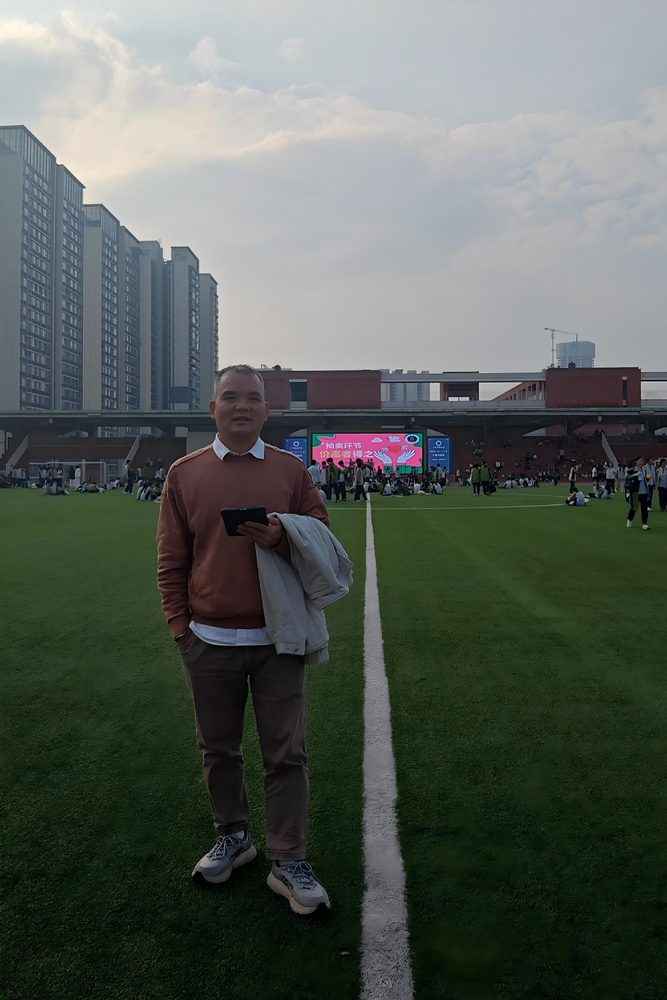

# 罗肖辉

- 栏目：计算机科学与工程系
- 日期：2026-04-27
- 原文：https://site.gcc.edu.cn/xydw/jsjkxygcx1/wljsygcjys1/ddc5b6112dcf401a929547cc3ef5c6e8.htm
- 照片：
  - 计算机科学与工程系\罗肖辉.jpg

罗肖辉，硕士，副教授、高级实验师，“双师双能型”教师。2004年本科毕业于华南师范大学教育技术学专业，2008年于华南理工大学软件工程专业获得硕士学位，分别于2019年、2024年通过高级实验师、副教授职称评审。2004年9月至2025年8月，在广州商学院信息化建设处部门负责网络规划建设、网络安全运维、数据中心云平台管理等工作，期间从事《计算机网络技术》《信息安全管理》《防火墙技术》《云计算应用技术》《云技术开发》《云存储技术》等课程的教学。2025年9月转为专任教师。公开发表学术论文8篇，主持和参与的省市级科研项目共6项，获得服务育人标兵、优秀共产党员、园区优秀教辅奖、年终考核优秀等奖励。
