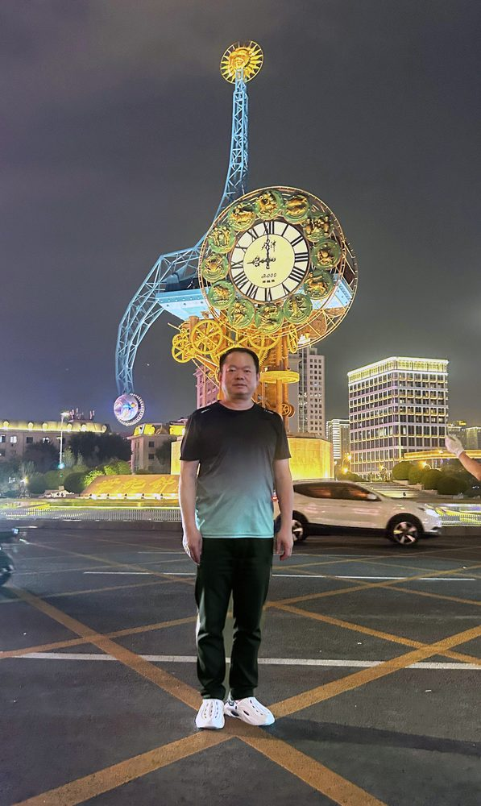

# 张欧亚

- 栏目：计算机系统与专业基础教研室
- 日期：2026-04-28
- 原文：https://site.gcc.edu.cn/xydw/jsjkxygcx1/jsjxtyzyjcjys1/088ae72e261b4ebab091bba0cd471e5b.htm
- 照片：
  - 计算机系统与专业基础教研室\张欧亚.jpg

张欧亚，计科系计算机系统与专业基础教研室副教授，山东济宁人，1971.11出生，中共党员，博士，硕士生导师。

某军校自动控制系测控工程专业本科（1994）、测试计量技术及仪器专业硕士（1999），西北工业大学（电子信息学院）系统工程专业博士（2008）。

1999-2020任教。退役后2021年入职广州商学院。

曾享受军队优秀专业技术人才岗位津贴，入选军校“创新人才工程”，多次被评为优秀教员、先进个人、优秀指导教师。主持或参与完成军种（市厅）以上级科研课题30多项，获军队科技进步二、三等奖7项，军研成果奖12项。发表学术论文50多篇，其中SCI收录3篇，EI收录10篇，获奖7篇，核心期刊30多篇。获教学成果奖3项。主编或参编专著16部、教材40余部，获奖3部。
