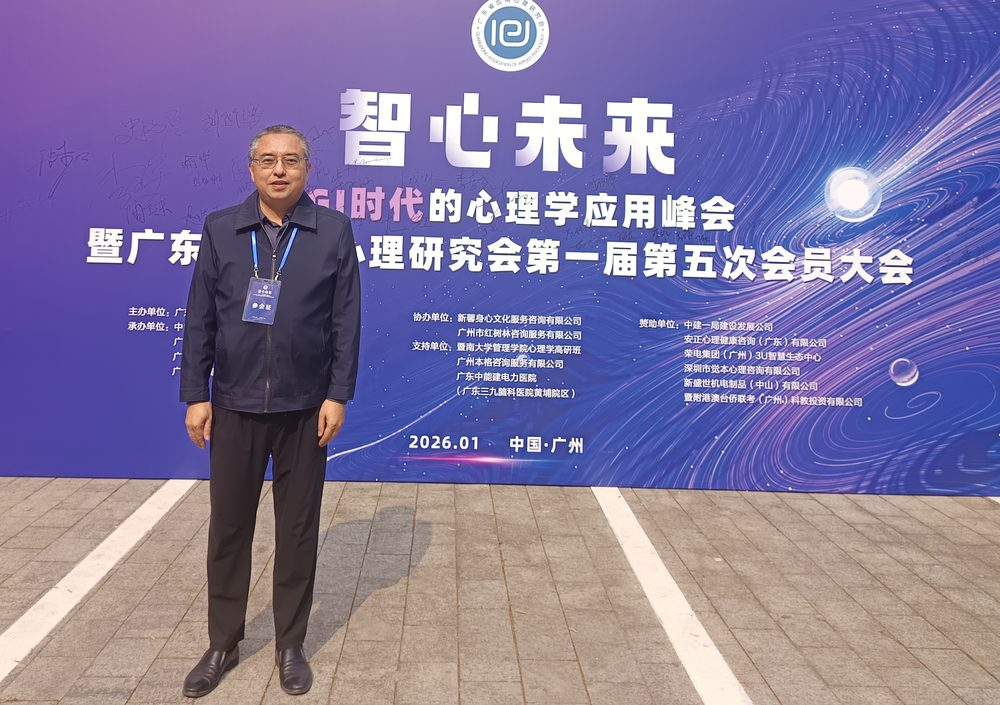

# 韩来权

- 栏目：计算机系统与专业基础教研室
- 日期：2026-04-28
- 原文：https://site.gcc.edu.cn/xydw/jsjkxygcx1/jsjxtyzyjcjys1/244b5290805b4432adb05689ccd46666.htm
- 照片：
  - 计算机系统与专业基础教研室\韩来权.jpg

韩来权，博士、教授、硕士生导师。从教27年，主要从事人工智能、未来网络等方向的科研和人才培养工作。兼任CCF互联网专委、大学生创业导师、全国职业技能竞赛裁判等工作；以第一完成人获得河北省科技进步奖和河北省教学成果奖各一项。发表学术论文40余篇，包括本领域顶级期刊1篇，SCI/EI收录30余篇；承担/参与国家杰出青年基金项目、国自然、中央电教馆、省科技厅、省教育厅等40余个科研课题；申请专利17个，其中12个已获授权，包括美国/欧洲授权国际专利2项；在30多个会议做学术报告，获优秀论文奖多项；承办/协办多个国内/国际学术会议；指导学生获国家级、省二级以上奖项30余项。
