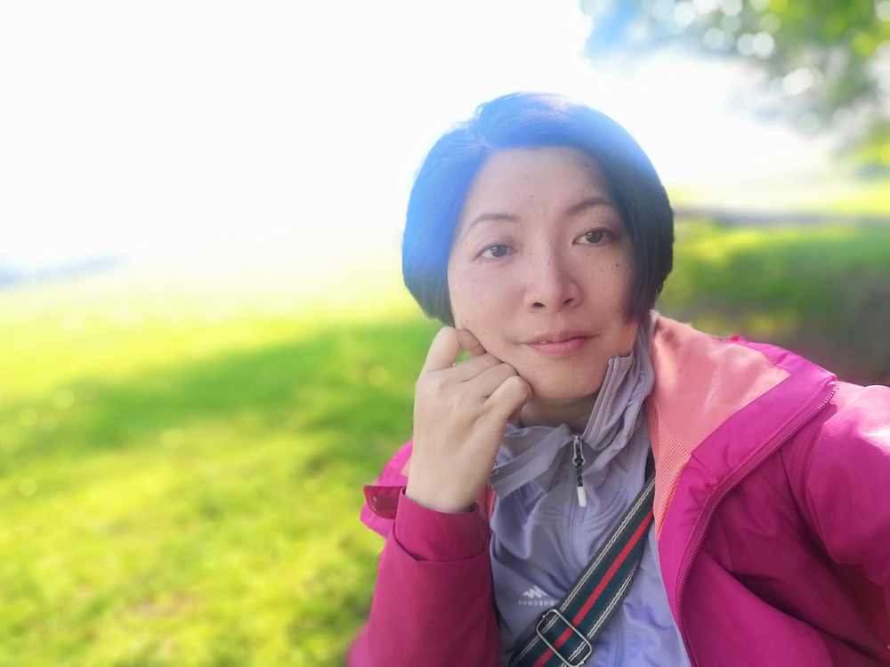

# 魏小英

- 栏目：计算机系统与专业基础教研室
- 日期：2026-04-28
- 原文：https://site.gcc.edu.cn/xydw/jsjkxygcx1/jsjxtyzyjcjys1/4cbecbeec8204b4783d91f4433730486.htm
- 照片：
  - 计算机系统与专业基础教研室\魏小英.jpg

魏小英，女，中共党员，毕业于华南理工大学，硕士研究生，计算机科学讲师，从事高校计算机应用研究与教学工作二十余年，主要承担操作系统、数据库原理与应用、程序设计等多门专业课程的教学工作，曾获广东省信息化教学大赛二等奖、广东省软件评审二等奖、广东省民办高校优秀教师、广东省软件评审活动先进个人、广东省高校资助工作先进个人、校级师德评价考核优秀个人等荣誉；在国家级、省级学术期刊发表多篇论文，编写创新创业与就业指导多本教材，指导学生参加广东省职业生涯规划大赛、职业技能大赛多次获奖。
