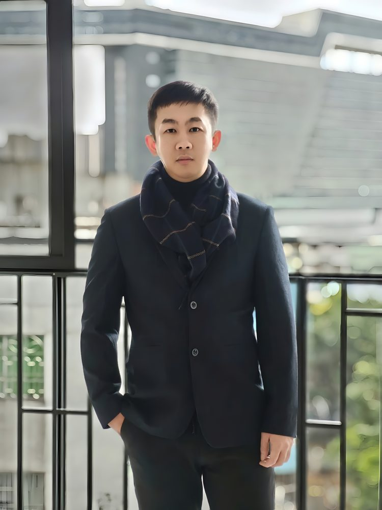

# 黄育钊

- 栏目：计算机系统与专业基础教研室
- 日期：2026-04-28
- 原文：https://site.gcc.edu.cn/xydw/jsjkxygcx1/jsjxtyzyjcjys1/4efe1a3d68f24182898356a5e7185233.htm
- 照片：
  - 计算机系统与专业基础教研室\黄育钊.jpg

黄育钊，中共党员，硕士研究生。2014年获广东工业大学计算机科学与技术学士学位，2017年获中山大学计算机技术硕士学位。主讲过《计算机应用基础》、《人工智能通识基础》等课程。拥有8年互联网行业从业经验，曾在网易、中移互联网等企业任职，具备丰富的软件项目策划与开发实践经验。主要研究方向为人工智能领域的智能计算、LLM智能体、多智能体协作，关注人工智能技术在教学场景中的融合应用。
