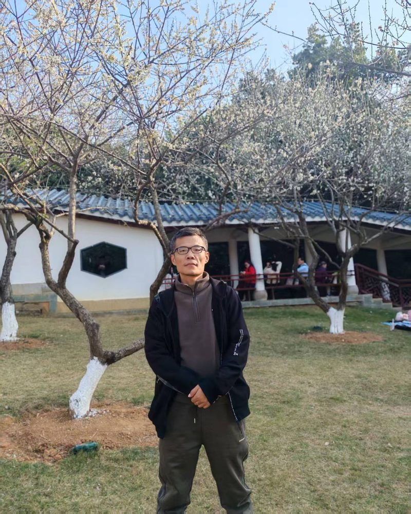

# 同军红

- 栏目：软件工程系
- 日期：2026-04-28
- 原文：https://site.gcc.edu.cn/xydw/rjgc/rjjsjcjys1/4841a4e721434ab58a172bd82237715f.htm
- 照片：
  - 软件工程系\同军红.jpg

同军红，男，副教授、高级工程师，“双师双能”型教师。现担任软件基础教研室主任、兼任学院教学督导，一流课程《离散数学》、《程序设计基础》负责人，主编教材多部，发表论文十多篇，主持和参加省级以上教研项目10余项。近三年指导学生参加大学生数学建模竞赛、大学生数学竞赛、挑战杯等省部级以上赛事获奖达30多项以上，主要的研究方向：嵌入式系统应用及开发，人工智能，数据分析与智能决策。主讲：离散数学、程序设计基础、操作系统等课程。
