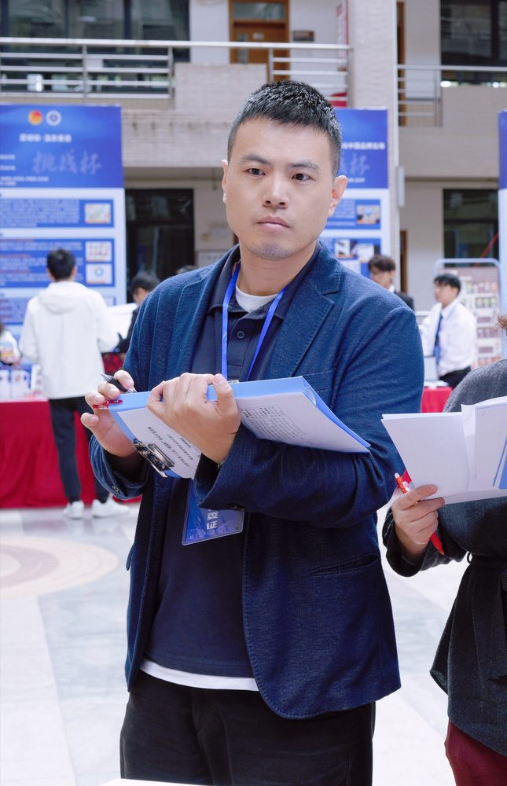

# 李长龙

- 栏目：软件工程系
- 日期：2026-04-28
- 原文：https://site.gcc.edu.cn/xydw/rjgc/rjjsjcjys1/1900eb0cfc7b441c9e85bccc084ee5cf.htm
- 照片：
  - 软件工程系\李长龙.jpg

李长龙，博士，副教授，长期专注于遥感大数据分析与城市空间规划等研究，在粤港澳大湾区高温环境、碳循环和生态系统动态监测等领域具有深厚研究基础。主持省级以上科研项目7项，包括广东省自然科学基金面上项目、广东省基础与应用基础研究区域联合基金项目、广州市基础与应用基础研究专题等，累计资金超150万元。发表学术论文30余篇，包括Ecological Indicators等国际顶级期刊及地理学报等中文核心期刊。担任中国科技部-欧洲空间局“龙计划”项目中方科学家，草原资源专业委员会委员等职务。在教学与科研方面成果突出，荣获中国商业联合会全国服务业科技创新二等奖，2023年校优秀教学奖和优秀科研奖，2024年校优秀科研奖，2025年校优秀教学奖等奖励。
