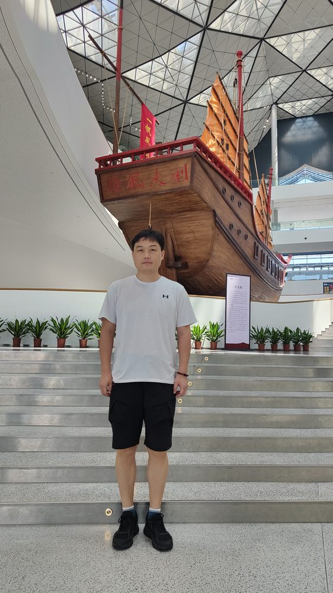

# 李文崇

- 栏目：软件系统架构教研室
- 日期：2026-04-28
- 原文：https://site.gcc.edu.cn/xydw/rjgc/rjxtjgjys1/6fc9745a64504f1290ea102d781293d0.htm
- 照片：
  - 软件系统架构教研室\李文崇.jpg

李文崇，研究生学历，硕士学位，副教授，高级工程师。研究方向为软件过程与管理、机器学习、Python程序设计、CSCL（计算机支持的协作学习）等。本科毕业河南师范大学物理学院，硕士毕业华南师范大学教育信息技术学院。主持或参与校级和省级项目10余项，发表科研和教研论文7篇，参与编写多部教材，两次被评为优秀教师，并获得“双师双能称号”。
