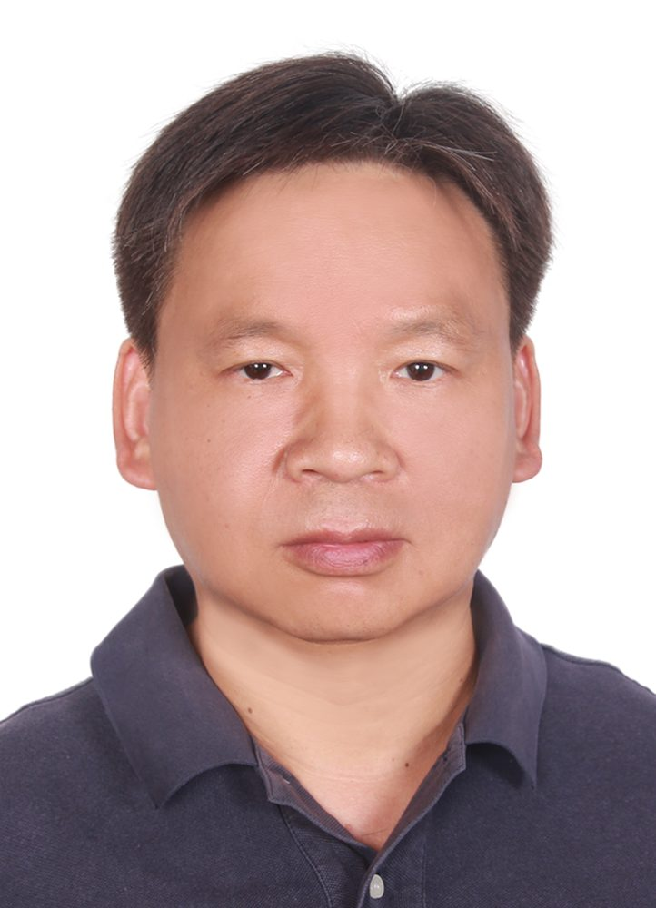

# 王家城

- 栏目：软件系统架构教研室
- 日期：2026-04-28
- 原文：https://site.gcc.edu.cn/xydw/rjgc/rjxtjgjys1/9117896f6f644adf8a6efa231615d7e6.htm
- 照片：
  - 软件系统架构教研室\王家城.jpg

王家城，博士。研究方向为现代通信技术与系统，通信信号调制与检测技术、数字信号处理技术等。硕士毕业于重庆大学应用数学专业，博士毕业于中国科学院计算数学与科学工程计算研究所。超过20年的宽带无线通信，3G/4G/5G移动通信空中接口技术研究及开发。发表科研论文9篇，授权发明专利8项。
