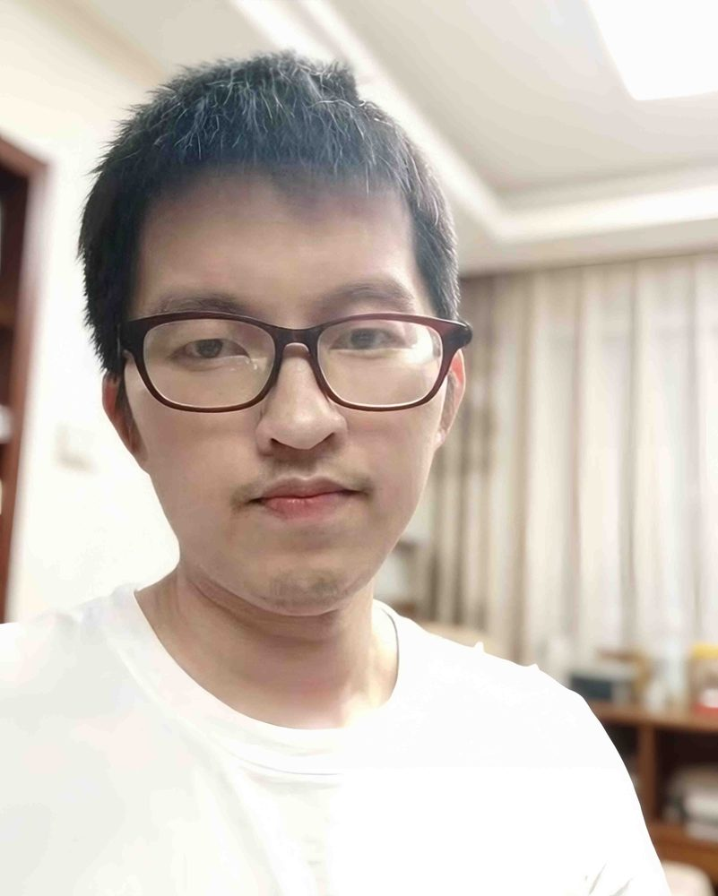

# 谢伟晶

- 栏目：软件系统架构教研室
- 日期：2026-04-28
- 原文：https://site.gcc.edu.cn/xydw/rjgc/rjxtjgjys1/42d59f4fb0894597bf74bdf842678f40.htm
- 照片：
  - 软件系统架构教研室\谢伟晶.jpg

谢伟晶，计算机工程硕士 ，信息技术与工程学院专任教师。研究方向包括企业级信息系统应用、Web架构应用技术、AI Agent智能体应用等。目前从事软件系统架构方向的教学与研究工作，主要承担《算法设计与分析》，《操作系统》，《Web应用开发课程实验》，《Web架构应用开发》等专业课程的教学任务。在企业工作期间，曾参与研发广州赤岗电动汽车充换电机器人系统、广州南方电力集团有限公司智能小区管理系统、黄埔社区健康档案管理平台，黄埔区智慧交通指挥系统等信息化项目，具备工程实践经验。教学中注重理论与实践相结合，善于将企业项目案例融入课堂教学，着力培养学生的工程实践能力，并积极推动产学研融合。
