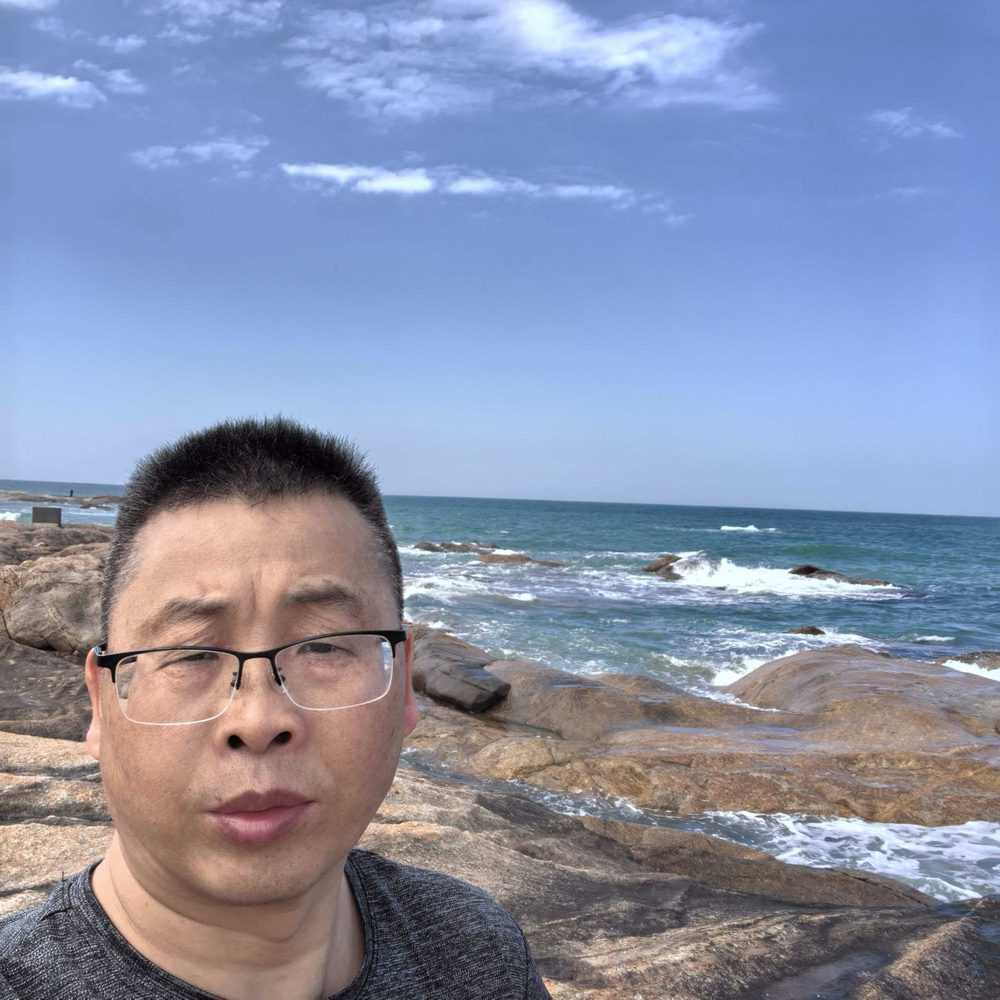

# 陈代进

- 栏目：软件系统架构教研室
- 日期：2026-04-28
- 原文：https://site.gcc.edu.cn/xydw/rjgc/rjxtjgjys1/70a03f0fdfa64ecfb3fddd8a809797c6.htm
- 照片：
  - 软件系统架构教研室\陈代进.jpg

陈代进，中共党员，高级工程师，1996年于华中师范大学获理学学士学位，2007年于华南师范大学获教育学硕士学位。
