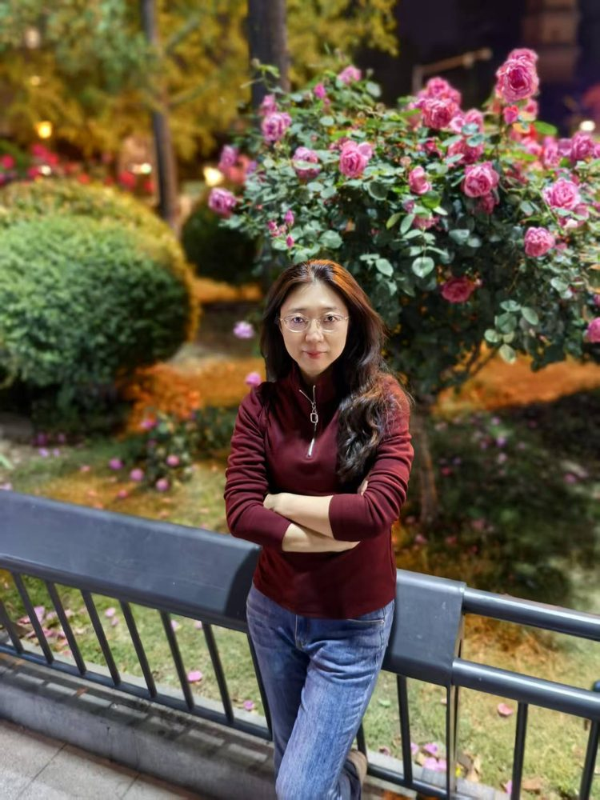

# 姜薇

- 栏目：鸿蒙技术与生态应用教研室
- 日期：2026-04-28
- 原文：https://site.gcc.edu.cn/xydw/jsjkxygcx1/hmjsystyyjys1/3e9aa826e5d44423a2905d9fbc695d5c.htm
- 照片：
  - 鸿蒙技术与生态应用教研室\姜薇.jpg

姜微，博士，讲师，华为开发布道师。现任信息技术与工程学院计算机科学与工程系鸿蒙技术与生态应用教研室主任。2020年入职至今，长期深耕计算机专业教学、学科科研与产教融合建设工作。科研领域，主持及参与多项省、校级教科研项目，发表高水平学术论文十余篇，承担横向课题5项，立足产业需求推进产学研协同发展。教学中主讲《鸿蒙北向开发基础》《鸿蒙北向开发高级》《大数据应用技术》等核心课程，教学功底扎实，教学考核多次获评优秀，屡获校级优秀教师荣誉。同时深耕实践育人，积极指导学生参与各类学科竞赛，助力学生专业成长，以赛促学、以赛促练，育人成果丰硕。
