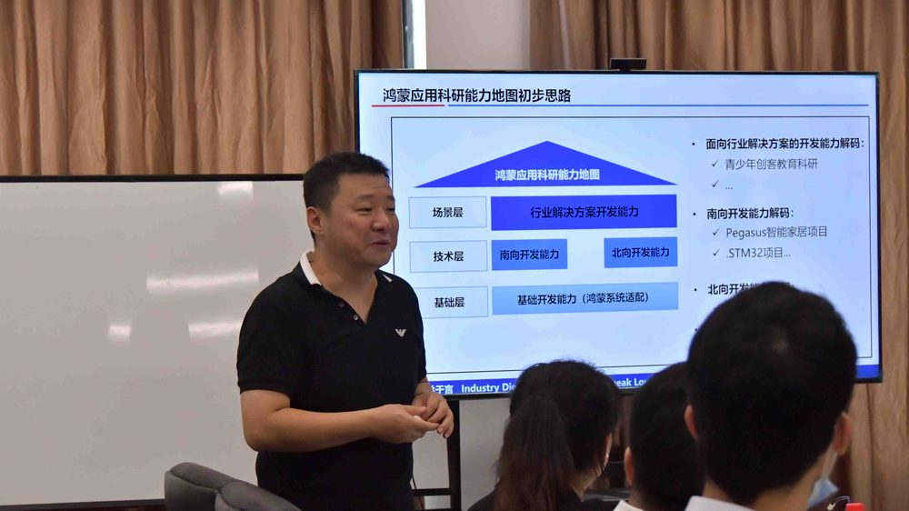

# 薄喜柱

- 栏目：鸿蒙技术与生态应用教研室
- 日期：2026-04-28
- 原文：https://site.gcc.edu.cn/xydw/jsjkxygcx1/hmjsystyyjys1/6587742e20a744069e232fa8fa0c61d3.htm
- 照片：
  - 鸿蒙技术与生态应用教研室\薄喜柱.jpg

薄喜柱，广州商学院信息技术与工程学院教师，鸿蒙技术与生态应用教研室，鸿蒙研究院院长、华为开发者布道师，双师双能型教师。1990-1994 年山西大学计算机软件专业，理学学士；1994-1997 年哈尔滨工程大学计算机应用技术专业，工学硕士；1997-2001 年哈尔滨工业大学计算机应用技术专业，工学博士。

曾任上海贝尔深研发系统工程师，在华为全球销售部 / 全球技术服务部主导与参与子公司管理与企业数字化转型项目，具备深厚产业实践经验。研究方向为多智能体系统、企业数字化转型、鸿蒙开发应用，专注鸿蒙原生智能、自动代码生成与行业解决方案研发，拥有丰富科研与工程转化能力。
